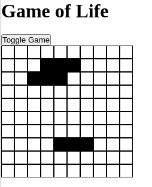

# Game Of Life

This is a version build just as a dojo, built with JS and PHP. The rules are analyzed in the backend, and the communication is via WebSockets.

This is how it looks like:



## Dependencies

- PHP7 with Swoole extension
- Docker

## How to Run

```shell
sh start.sh
```
